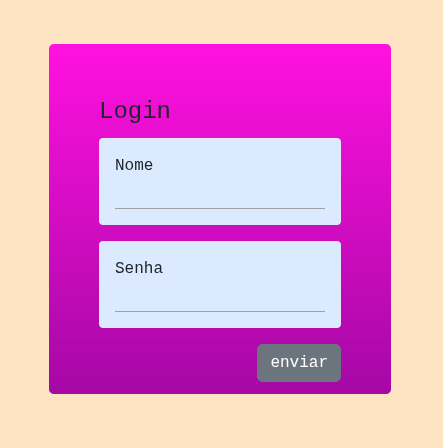

# form-default
### Descrição:
um formulario padrão para meus projetos que roda em um servidor remoto vite, estilizado com taiwind e boostrap

### Feramentas usadas:
&nbsp;
&nbsp;
&nbsp;
&nbsp;
&nbsp;

  

